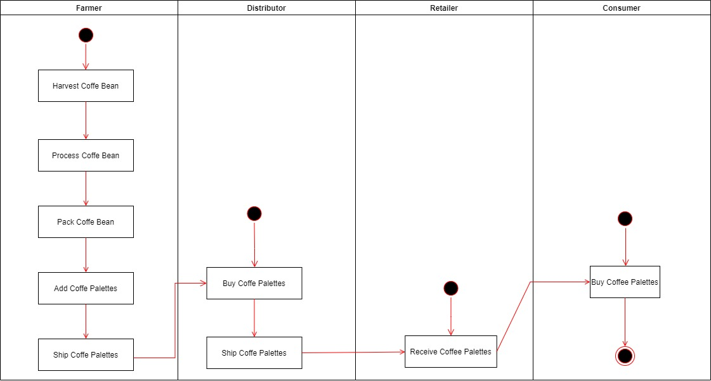
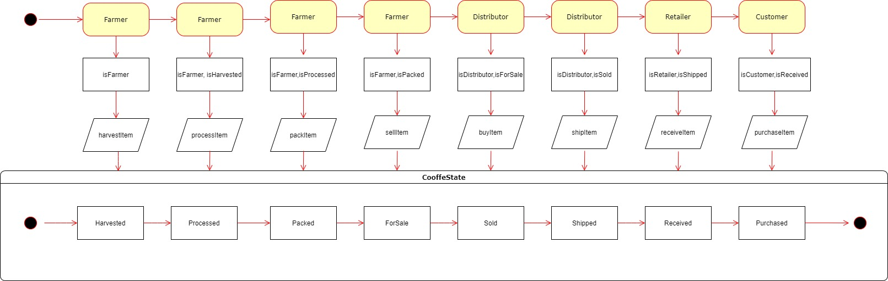
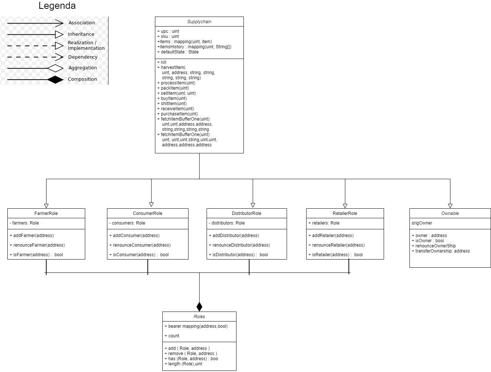

### REQUEST INFORMATION TO SUBMIT PROJECT ###
- Changed truffle.js to truffle-config.js to fix windows terminal problem
  as tiped here https://ethereum.stackexchange.com/questions/21017/truffle-microsoft-jscript-runtime-error

- Followed all tips in the link
  https://andresaaap.medium.com/architect-a-blockchain-supply-chain-solution-part-b-project-faq-udacity-blockchain-da86496fce55
  suggested in peer chat
  
## Part 1: Plan the project with write-ups ##
diagrams path : .\diagram in format jpeg or drawio
Activity
- activity_diagram_project3.jpg
- activity_diagram_project3.drawio
  

Sequence (took from Part3 of Project's requirements)
- sequence_diagram_project3.png
 

State
- state_diagram_project3.jpg
- state_diagram_project3.drawio
 

Classes (Data Model)
- class_diagram_project3.jpg
- class_diagram_project3.drawio
 

## Part 2: Project write-up - Libraries ##
npm: 6.14.13

node: 14.17.3

truffle: 5.4.14 - a development framework for Ethereum

web3: ^1.6.1" - to connect on blockchain

Solidity: ^0.4.24 - to compile solidity language

@truffle/hdwallet-provider: ^1.7.0 - to manage connection to wallet from truffle

Infura - deploying smart contract

# Requirement 3: Project write-up - IPFS #
I didn't use IPFS

# Address Smart Contract Supply Chain #
SupplyChain.address : XXXXXXXXXXXXXXXXXXXXXXXXXXXX

# ---------------------------------------------- #
# ---------------------------------------------- #
# ---------------------------------------------- #

TRUFFLE 

D:\blockchain\UdacityBlockchainDeveloper\Project3\project-6>truffle devel
Truffle Develop started at http://127.0.0.1:9545/

Accounts:
(0) 0x7727f4462fe8b37aaf0fc333a9067b7c044c7e2b
(1) 0x7ee91fca921e213689d8948fcb142a37599d09a0
(2) 0xfbef5f0f3e9bfedc0e014d502e203b118bf79af9
(3) 0x05ea0912124dddf0b4d3138567dc741e6895010c
(4) 0x7c1c44f89a047dbc1536cc6734d59b1514d2f10c
(5) 0xe2c56ea5fee52b21e804484c062b2826f04e1158
(6) 0x38bef1d4ab1cc6aad4829a4907cfc93b42a20d8a
(7) 0x1a26b950ef6b9e014d1c914cb1f1d03519936ecd
(8) 0xa606a7801f3c4b1eb788e9189c2584f068958be2
(9) 0x42acf7b1b89e0b335189030efb7188a2cb6f133d

Private Keys:
(0) 1d5b20e513b937b3461236d4f1d5af4d59b427100399ea737bb6409665a62280
(1) 566acd0d7e89257d72dd8a6bb0585ac6becfa6e5ec6ab15b57c5cc78b7c7a7d1
(2) 7d476ae4cf90aa1cf5144285969328fe8227dc02c48340b515e206be1d9bd803
(3) 5daee62d602da6cf7fa4cdb8925273493bc7c38366c97c059c4799847d893b0f
(4) 85bde95513c657c77c26738e977e23989ad450d485b96f89e64c1f80b755b6c0
(5) 28304db08eb66ad0834eaa46fe657097bfef72bc6a1ebf00a4d2bbd3ed6b8074
(6) 1529c15ba441768ce6a5f7f29d79548c5f927c9b6a3ade00d0768f7d09398b69
(7) 854b100bd793be0576a79a10326940b83619ac8b52d25c757e880f8f4427823a
(8) da8a2ee654fe264fbc867bea94f46996bb41f2cd2459d334c523141b5619f1e5
(9) 6338900ea36939567ea75a98145360fba8ca463751d61dae9a0d211c0d2718cc

Mnemonic: minute jungle melody odor quote parrot benefit suspect exclude bike flee gate

⚠️  Important ⚠️  : This mnemonic was created for you by Truffle. It is not secure.
Ensure you do not use it on production blockchains, or else you risk losing funds.

truffle(develop)> compile
truffle(develop)> migrate --reset
Using network 'develop'.

Compiling your contracts...
===========================
> Everything is up to date, there is nothing to compile.

Starting migrations...
======================
> Network name:    'develop'
> Network id:      5777
> Block gas limit: 6721975 (0x6691b7)

1_initial_migration.js
======================

   Replacing 'Migrations'
   ----------------------
   > transaction hash:    0xd911f9f9cd0a1a5c2ce2a782fa914bb2809ff47dfef208e2cf9802e315879a31
   > Blocks: 0            Seconds: 0
   > contract address:    0x2702A75Ad89233FB9301dA0cAF6594B1380e9224
   > block number:        1
   > block timestamp:     1638798723
   > account:             0x7727F4462fe8B37aAf0FC333a9067B7C044C7E2b
   > balance:             99.999522812
   > gas used:            238594 (0x3a402)
   > gas price:           2 gwei
   > value sent:          0 ETH
   > total cost:          0.000477188 ETH

   > Saving migration to chain.
   > Saving artifacts
   -------------------------------------
   > Total cost:         0.000477188 ETH

2_deploy_contracts.js
=====================

   Replacing 'FarmerRole'
   ----------------------
   > transaction hash:    0x68d2afe2c5aa2780f56f1231c42cc06ef702c4a560d26bbdfff9db2f3615ad19
   > Blocks: 0            Seconds: 0
   > contract address:    0x52288F3058a193C774c09d393BE740921B11F69a
   > block number:        3
   > block timestamp:     1638798724
   > account:             0x7727F4462fe8B37aAf0FC333a9067B7C044C7E2b
   > balance:             99.998810474
   > gas used:            313821 (0x4c9dd)
   > gas price:           2 gwei
   > value sent:          0 ETH
   > total cost:          0.000627642 ETH

   Replacing 'DistributorRole'
   ---------------------------
   > transaction hash:    0x157b863f07f8c280c7ed324f3fa1fa48011a3e8d0a12aef58c04594e4162b9b4
   > Blocks: 0            Seconds: 0
   > contract address:    0xC1ca88a45aCB1824b8D9EfCcd918A800B380246F
   > block number:        4
   > block timestamp:     1638798724
   > account:             0x7727F4462fe8B37aAf0FC333a9067B7C044C7E2b
   > balance:             99.998154264
   > gas used:            328105 (0x501a9)
   > gas price:           2 gwei
   > value sent:          0 ETH
   > total cost:          0.00065621 ETH

   Replacing 'RetailerRole'
   ------------------------
   > transaction hash:    0xe4095033a941aedb28e5c628e8c7785343eca64076828178978ea86d8ec5dac1
   > Blocks: 0            Seconds: 0
   > contract address:    0x71516646Dda70d80C6A5b8140337D515dceeFa7d
   > block number:        5
   > block timestamp:     1638798724
   > account:             0x7727F4462fe8B37aAf0FC333a9067B7C044C7E2b
   > balance:             99.997526598
   > gas used:            313833 (0x4c9e9)
   > gas price:           2 gwei
   > value sent:          0 ETH
   > total cost:          0.000627666 ETH

   Replacing 'ConsumerRole'
   ------------------------
   > transaction hash:    0x83556759736a0f19baa5dff9d55e1b729e1a74a3fe77b928b0eed6e1163648ec
   > Blocks: 0            Seconds: 0
   > contract address:    0x46CB4f1d9B131b84434a6Cd4505876d263EE9b52
   > block number:        6
   > block timestamp:     1638798725
   > account:             0x7727F4462fe8B37aAf0FC333a9067B7C044C7E2b
   > balance:             99.996870388
   > gas used:            328105 (0x501a9)
   > gas price:           2 gwei
   > value sent:          0 ETH
   > total cost:          0.00065621 ETH

   Replacing 'SupplyChain'
   -----------------------
   > transaction hash:    0x35b1a906f5f7c8710147b79fbcb84dc2eca41f26db7b216441d5b86abd716445
   > Blocks: 0            Seconds: 0
   > contract address:    0x588Ba2Fc5fD1881f9FaC74b0abEc38819724006D
   > block number:        7
   > block timestamp:     1638798725
   > account:             0x7727F4462fe8B37aAf0FC333a9067B7C044C7E2b
   > balance:             99.991715646
   > gas used:            2577371 (0x2753db)
   > gas price:           2 gwei
   > value sent:          0 ETH
   > total cost:          0.005154742 ETH

   > Saving migration to chain.
   > Saving artifacts
   -------------------------------------
   > Total cost:          0.00772247 ETH

Summary
=======
> Total deployments:   6
> Final cost:          0.008199658 ETH

- Fetching solc version list from solc-bin. Attempt #1
- Blocks: 0            Seconds: 0
- Saving migration to chain.
- Blocks: 0            Seconds: 0
- Blocks: 0            Seconds: 0
- Blocks: 0            Seconds: 0
- Blocks: 0            Seconds: 0
- Blocks: 0            Seconds: 0
- Saving migration to chain.

truffle(develop)> test
Using network 'develop'.

Compiling your contracts...
===========================
> Everything is up to date, there is nothing to compile.

ganache-cli accounts used here...
Contract Owner: accounts[0]  0x7727F4462fe8B37aAf0FC333a9067B7C044C7E2b
Farmer: accounts[1]  0x7Ee91FCA921E213689d8948FcB142A37599D09A0
Distributor: accounts[2]  0xFbEF5F0F3E9BfedC0E014d502e203b118bF79af9
Retailer: accounts[3]  0x05Ea0912124ddDF0B4d3138567DC741e6895010c
Consumer: accounts[4]  0x7C1C44F89a047DBC1536cc6734D59b1514d2f10C

  Contract: SupplyChain
    ✓ Testing smart contract function harvestItem() that allows a farmer to harvest coffee (335ms)
    ✓ Testing smart contract function processItem() that allows a farmer to process coffee (192ms)
    ✓ Testing smart contract function packItem() that allows a farmer to pack coffee (186ms)
    ✓ Testing smart contract function sellItem() that allows a farmer to sell coffee (207ms)
    ✓ Testing smart contract function buyItem() that allows a distributor to buy coffee (212ms)
    ✓ Testing smart contract function shipItem() that allows a distributor to ship coffee (163ms)
    ✓ Testing smart contract function receiveItem() that allows a retailer to mark coffee received (261ms)
    ✓ Testing smart contract function purchaseItem() that allows a consumer to purchase coffee (255ms)
    ✓ Testing smart contract function fetchItemBufferOne() that allows anyone to fetch item details from blockchain (60ms)
    ✓ Testing smart contract function fetchItemBufferTwo() that allows anyone to fetch item details from blockchain (65ms)

  10 passing (2s)

- Fetching solc version list from solc-bin. Attempt #1